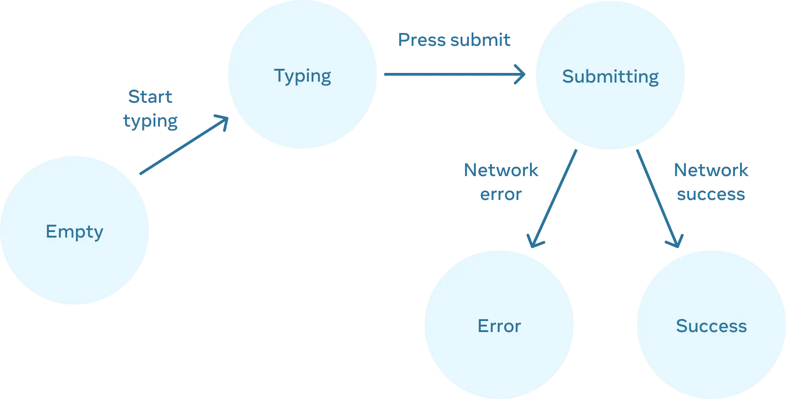

# react-tutorial

## Week 1 & 2: Core Web & JS Basics 

### Flex box;

          Flexbox is a way to arrage items into rows and columns. This items will flex (either grow or shrink) based on the certain rules we define. 

#### display: flex;

This turn the box into a flex box. By default the elements in then flex box will be align rowise. 

### jutify-content: (flex-start, flex-end, center)

It works around the main axis. flex-start: will align the content from the start of the axis. flex-end will align the content to the end of the axis and center will align content in the center. 

It has additional complex arrangements like Space-between, Space-around, Space-evenly. This helps to play with the space between the content.

### align-items:(center, end, start,...)

It worls around the cross axis. It helps to place content at the center or end or start of the div (box). Ever row has its own axis. 

### align-content:

This will align all the content according to a central axis. This will help to arrange all the items evenly. 

### flex-direction: (row, column)

It helps to set the content in rowise or column wise manner. 

### gap: 10px; 

It helps to set some gap between the content. 

### flex-wrap: 

It will wrap the elements to the next line if flex-wrap: wrap is selected. 

### flex-grow

Allows getting bigger

### flex-shrink 

Allows getting smaller

### Grid 

        Grid is another CSS property which can be used to format the page layout to keep the website
responsive

### grid-template-column: (column1 column2 column3 .. column12)

We can use different types of grid tempplate setting like each column width in pixels or percentage or even fraction (1fr or 4fr). 

-- minmax(#min-width, #max-width), in this case the container will keep growing when the page size grows and shrink to the min-width

-- repeat(3, #width). This will help us to create 3 container of size width

### grid-start, grid-end:

This sets the start of the grid and end of the grid

### Semantic tags

Three reasons to use Semantic tags

1. Easier to read / scan the HTML
2. Better for SEO
3. Better for screen readers / accessibility

### JavaScript ES6+

check the Script.js file 

## Week 3;

### React

#### React Life cycle.

Refer: (Thinking in React) https://react.dev/learn/thinking-in-react

### Managing States 

#### Step 1. Identify your components different visual state

- Empty: Form has a disabled “Submit” button.

- Typing: Form has an enabled “Submit” button.

- Submitting: Form is completely disabled. Spinner is shown.

- Success: “Thank you” message is shown instead of a form.

- Error: Same as Typing state, but with an extra error message.

#### Step 2. Determine what triggers those state changes

You can trigger state updates in response to two kinds of inputs:

- Human inputs, like clicking a button, typing in a field, navigating a link.
- Computer inputs, like a network response arriving, a timeout completing, an image loading.

In both cases, you must set state variables to update the UI. For the form you’re developing, you will need to change state in response to a few different inputs:

- Changing the text input (human) should switch it from the Empty state to the Typing state or back, depending on whether the text box is empty or not.
- Clicking the Submit button (human) should switch it to the Submitting state.
- Successful network response (computer) should switch it to the Success state.
- Failed network response (computer) should switch it to the Error state with the matching error message.

#### Step 3. Represent the State in memory with useState

#### Step 4. Remove any non-essential state variable

#### Step 5. Connect the event handler to the set state

#### Reducers

## TODO APP

Add/Edit/Delete new items to the existing list
Creates a new List
Save it somewhere

## Weather APP

Shows weather for location 

Can pin the weather of a location for tracking it.

