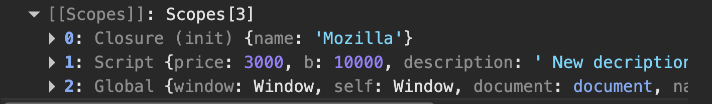

# What is React? Why do we need React?

React is a JavaScript library used to build user interfaces, mainly for web applications.
It’s created by Facebook (Meta) and helps developers build fast, interactive, and reusable UI components.

        React helps you build dynamic websites that update instantly without reloading the entire page.

## Why do we need React?

1. `Faster and smoother apps`:
React uses something called the Virtual DOM — a lightweight copy of the real DOM.
When something changes on the page, React updates only what’s needed, not the whole page.
➡️ This makes the app fast and efficient.

2. `Reusable components`:
You can create independent, reusable pieces of UI called components (like buttons, forms, cards, etc.).
➡️ This saves time and makes your code easier to manage.

3. `Declarative approach`:
You just describe what you want to see, and React takes care of how to render it.
➡️ This makes the code more readable and predictable.


#### Imperative (Javascript)

```javascript

const button = document.createElement('button');
button.textContent = 'Click me';
button.addEventListener('click', () => {
    button.textContent='Clicked!';
});
document.body.appendChild(button);

```
In the above code you are telling the browser to:
- Create a button
- Set Text
- Handle clicks
- Update text manually

#### Declarative (React)

```Javascript

function App() {
  const [clicked, setClicked] = React.useState(false);

  return (
    <button onClick={() => setClicked(!clicked)}>
      {clicked ? 'Clicked!' : 'Click me'}
    </button>
  );
}


```

- Here, you’re not telling React how to change the button text.
You’re simply saying:

“If clicked is true → show ‘Clicked!’, else → show ‘Click me’.”

- React automatically updates the DOM when the state changes.
You describe what the UI should be, not how to change it.


#### Why declarative is Better

- You describe what you want rather than you telling how to do it.
- React handles DOM updates rather than you manually update DOM 
- Easier to read and maintain rather than impleratove which is Harder to debug and modify
- Scales well for complex UIs while implerative gets messy as app grows


4. `Strong community and ecosystem`:
React is widely used and supported.
You get many libraries, tools, and tutorials, which makes development faster and easier.

5. `Supports modern app needs`:
React is perfect for Single Page Applications (SPAs) — where content updates dynamically without full page reloads.
It can also be used for mobile apps via React Native.


# What is virtual DOM?

The Virtual DOM (VDOM) is a lightweight copy of the real DOM (the structure of your webpage in memory).

When you change something in React (like updating state), React:

- Creates a new Virtual DOM that represents how the UI should look now.

- Compares it with the previous Virtual DOM (this is called diffing).

- Updates only the changed parts in the real browser DOM.

```javascript 
import {React, useState} from 'react'

function Counter(){
    const [count, setCount] = useState(0);
    
    return (
        <div>
            <h1>{count}</h1>
            <button onClick={() => setCount(count + 1)} >Add </button>
        </div>
    )
}

export default Counter;

```
Here’s what happens when you click the “Add” button 👇

- setCount(count + 1) updates the state -> count becomes 1
- React re-renders the component -> creates a new `virtual DOM` showing `<h1>1</h1>`
- React compares this new Virtual DOM with the old one `<h1>0</h1>`
- React finds that only the text inside `<h1>` changed
- React updates only that part in the real DOM - not the whole page.

#### Virtual DOM + Declarative = Power Combo

- Declarative: You describe what the UI should look like
- Virtual DOM: React efficiently figures out what changed
- Together: You focus on what you want, React handles how

# What is a SINGLE PAGE APPLICATION?

A Single Page Application (SPA) is a web app that loads just one HTML page, and then dynamically updates its content as you interact with it — without reloading the entire page.


#### How it works

When you first visit the site, the browser loads one HTML page (usually index.html) along with JavaScript and CSS.

After that, when you click on buttons or links:

The app doesn’t reload the page.

It fetches new data (usually via APIs).

React (or another JS framework) updates only the needed part of the page.

# What is JSX? How it differs from HTML?

JSX (JavaScript XML) is a syntax extension for JavaScript that lets you write HTML-like code inside JavaScript.

It’s what React uses to describe the UI.

In short, JSX lets you write UI components that look like HTML but work like JavaScript.

```javascript

function Welcome() {
  return <h1>Hello, React!</h1>;
}

```
This looks like HTML, but it’s actually JavaScript under the hood.
React converts this JSX into regular JavaScript calls like

```javascript

React.createElement('h1', null, 'Hello, React!');

```
So JSX just makes your code cleaner and easier to read.


#### Why JSX is Used

- Easier to write and visualize UI components.

- Lets you mix HTML structure + JavaScript logic in one place.

- Helps React efficiently update the UI.


# Explain diff between class and functional components?

Components are building blocks of a React app — they let you split the UI into reusable pieces.

There are two main types:

- Class Components (older way)

- Functional Components (modern way)

### Class Components

```js

import React, { Component } from 'react'

export default class SampleClassComponent extends Component {
  render() {
    return (
      <div>SampleClassComponent</div>
    )
  }
}

```
Use the `render()` method to return JSX.
Use this.state and this.setState() for managing state.
Lifecycle methods like `componentDidMount()`, `componentDidUpdate()`, etc.

### Functional Components

```js
import {React} from 'react';
function Welcome(props) {

const [count, setCount] = React.useState(0);

  return <h1>Hello, {props.name}</h1>;
}


```

# Statefull vs Stateless

### What is state in React?

State is an object that holds data which can change over time — and when it changes, React re-renders the component.

```js

const [count, setCount] = React.useState(0);

```
Here, count is the state, and changing it will update the UI automatically.

### Stateful Component

A stateful component is one that manages its own state — meaning it can store and update data internally.

```js

function Counter() {
  const [count, setCount] = React.useState(0);

  return (
    <button onClick={() => setCount(count + 1)}>
      Count: {count}
    </button>
  );
}

```

➡️ Counter keeps track of its count value.
It has state → so it’s stateful.

Characteristics

- Holds and manages local data (state).
- Reacts to user input or events.
- Causes re-render when state changes.

### Stateless Component

A stateless component (also called presentational component) doesn’t hold any state — it just receives data via props and displays it

```js

function Greeting(props) {
  return <h1>Hello, {props.name}</h1>;
}


```
➡️ Greeting only shows what it’s given — it doesn’t manage any data.
So it’s stateless.

Characteristics:
- Purely presentational.
- No internal data management.
- Output depends only on props.

# What are props in react and how are they used?

Props (short for properties) are inputs to a React component.
They allow you to pass data from a parent component to a child component.

Props are like function arguments for components.


`Parent Component`

```js
function App() {
  return <Greeting name="Vrishabh" />;
}

```

`Child Component`
```js

function Greeting(props) {
  return <h1>Hello, {props.name}!</h1>;
}


```
#### Key points about props

- Read-only: You cannot change props inside a child element
- Passed from parent to child: Data always flows one way
- Resuable components: Props let you use the same component with different data. 
- Accessed via: `props.propertyName` or directly via destructuring


# What is diff between props ans state?

| Feature                 | **Props**                          | **State**                                           |
| ----------------------- | ---------------------------------- | --------------------------------------------------- |
| **Owned by**            | Parent component                   | The component itself                                |
| **Can be changed by**   | Parent only                        | The component itself                                |
| **Mutability**          | Read-only                          | Mutable (can change using `setState` or `useState`) |
| **Purpose**             | Pass data down to child components | Manage local data that changes over time            |
| **Triggers re-render?** | Yes, if parent passes new props    | Yes, when state changes internally                  |


# What are controlled and uncontrolled components?

Both terms describe how form inputs (like text boxes, checkboxes, etc.) are managed in React.


### Controlled Component

A controlled component is one where React controls the form data through state.

That means:

- The input’s value is stored in state.

- Every change in the input updates the state.

- The UI always reflects the state value.

```js

import {React, useState} from 'react'

const Controlled = () => {

    const [name, setName] = useState('');

    return (
        <>
        <form>
            {name}
            <input
            onChange={(e) => setName(e.target.value)} // Update State
            type="text"
            value={name} // Value controlled by React
            />

        </form>
        </>
    )
}

export default Controlled;


```

Here the input value is fully controlled by React's `state`.

### Uncontrolled Components

An uncontrolled component is one where the DOM itself handles the form data, not React.

You use a ref to access the input’s value only when needed (like on submit).

```js

import {useRef} from 'react'

const Uncontrolled = () => {
    const nameRef = useRef();

    return (
        <div>
            <input type='text' ref={nameRef} />
            <button onClick={() => alert(`Hello ${nameRef.current.value}`)}> Uncontrolled</button>
        </div>
    )
}

export default Uncontrolled;

```
Key points:

- Data is handled by the DOM, not React.

- Useful for simple or quick forms.

- Harder to validate in real time.


| Feature                  | **Controlled Component**        | **Uncontrolled Component** |
| ------------------------ | ------------------------------- | -------------------------- |
| **Data managed by**      | React state                     | DOM (via refs)             |
| **Access value**         | From state                      | From `ref.current.value`   |
| **Real-time validation** | ✅ Easy                          | ❌ Harder                   |
| **Performance**          | Slightly slower for many inputs | Faster for simple cases    |
| **Recommended for**      | Complex or dynamic forms        | Simple, one-time inputs    |

# What is key attribute in React list?

The key is a special attribute you give to elements inside a list when rendering them dynamically (using .map() or loops).

It helps React identify which items have changed, been added, or removed — so React can update the UI efficiently.

```js
function Fruits() {
  const fruits = ["Apple", "Banana", "Mango"];

  return (
    <ul>
      {fruits.map((fruit, index) => (
        <li key={index}>{fruit}</li>
      ))}
    </ul>
  );
}

```
✅ Here React can track each <li> element uniquely using its key.

Better example

```js
import React from "react";

const List = () => {

    const people = [
        {
            id:1,
            name:"Vrishabh"
        },
        {
            id:2,   
            name:"Vrishabh"
        }
    ]

    return (
        <h1>{people.map((val) => (
            <p key={val.id} >{val.name}</p>
        ))} </h1>
    )
}

export default List;

```

### Why keys are important?

React uses keys during its reconciliation process (`rerendering`) — when it compares the new Virtual DOM with the previous one.
- If a list changes (like an item is added or removed),
- React uses keys to quickly find which elements changed,
- And only updates those, not the whole list.

This makes rendering faster and more accurate.

# What are fragments?

In React, Fragments let you group multiple elements without adding extra nodes (like a <div>) to the DOM.

```js

{
  items.map(item => (
    <React.Fragment key={item.id}>
      <dt>{item.name}</dt>
      <dd>{item.value}</dd>
    </React.Fragment>
  ))
}

```
Why do we need them?

In React, when you return elements from a component, you can only return one parent element.
But sometimes you want to return multiple sibling elements without wrapping them in an unnecessary container.


# What are React Lifecycle methods? Where are they used?

React components (especially class components) go through a series of stages — from being created, to updated, to removed from the DOM.

### 3 Main Phases of a Component’s Lifecycle

1. Mounting (when the component is created and inserted into the DOM)

Lifecycle methods:

- constructor() → for initializing state or binding methods

- componentDidMount() → runs after the component is rendered

- ✅Common use: Fetching data from an API

2. Updating (when props or state change)

Lifecycle methods:

- shouldComponentUpdate() → decide whether to re-render

- componentDidUpdate() → runs after re-rendering happens

- ✅ Common use: Responding to state or prop changes, API re-calls

3. Unmounting (when the component is removed from the DOM)

Lifecycle method:

- componentWillUnmount() → runs before the component is destroyed
✅ Common use: Cleaning up timers, subscriptions, or event listeners


### Class Lifecycle

| Lifecycle Method            | When It Runs             | Purpose                                 |
| --------------------------- | ------------------------ | --------------------------------------- |
| **constructor()**           | Before render            | Initialize state, bind methods          |
| **render()**                | Every time UI updates    | Displays the UI                         |
| **componentDidMount()**     | After first render       | Fetch data, start timers, subscriptions |
| **shouldComponentUpdate()** | Before re-render         | Decide if update is needed              |
| **componentDidUpdate()**    | After re-render          | Respond to state/prop changes           |
| **componentWillUnmount()**  | Before removing from DOM | Cleanup (stop timers, remove listeners) |

### Functinal Lifecycle

In functional components, we use the useEffect hook to handle all lifecycle events that class components manage with methods like componentDidMount, componentDidUpdate, and componentWillUnmount

```js
useEffect(() => {
  // 1️⃣ Runs when the component mounts (like componentDidMount)
  // 2️⃣ Runs again when dependencies change (like componentDidUpdate)
  // 3️⃣ Runs cleanup before unmount (like componentWillUnmount)
}, [dependencies]);

```

| Class Component          | Functional Component                  |
| ------------------------ | ------------------------------------- |
| `componentDidMount()`    | `useEffect(() => {}, [])`             |
| `componentDidUpdate()`   | `useEffect(() => {}, [dependencies])` |
| `componentWillUnmount()` | Cleanup function in `useEffect`       |


# super() and super(props)

In a React class component, the `super()` keyword is used inside the constructor to call the constructor of the parent class, which is `React.Component`. This call is essential because it initializes the `this` context of the class component and allows you to access properties and methods inherited from `React.Component`.[1][2][3]

### Why `super()` is Needed

- When you define a constructor in a subclass (like a React component extending `React.Component`), JavaScript requires you to call `super()` before you can use `this`. If you try to access `this` before calling `super()`, it will throw an error because the instance is not properly initialized.[3][1]
- The `super()` call executes the parent class’s constructor method, setting up the inheritance chain properly so React can manage the component lifecycle and properties.[2][3]

### Using `super()` vs `super(props)`

- Calling just `super()` calls the parent class constructor without providing it any arguments.  
- Calling `super(props)` passes the component's `props` to the parent constructor, making `this.props` immediately available inside the constructor. This is important because if you want to use `this.props` to initialize state or access props values within the constructor, you need to pass them via `super(props)`.[8][1][3]
  
### Example

```jsx
class MyComponent extends React.Component {
  constructor(props) {
    super(props); // Necessary to access this.props
    this.state = { count: 0 };
  }
  
  render() {
    return <div>{this.props.name}: {this.state.count}</div>;
  }
}
```

If you omit `super(props)` and try to use `this.props` inside the constructor, it will be `undefined`, causing bugs.[3][8]

### Summary

- Always call `super()` in a React class component constructor if you define one.
- Use `super(props)` when you need to access `this.props` inside the constructor.
- This ensures proper initialization of the component and enables usage of props and state as expected within the class.


# Explain diff between `useState` and `useEffect`

1. ⚙️ 1. useState — For Storing Data (State Management)

### What it does:

- `useState` is used to store and update values that can change over time in your component (like user input, counter, API data, etc.).

- When the state changes → React re-renders the component to show the new value.

2. useEffect — For Side Effects (Actions outside UI)

- `useEffect` is used to run side effects — actions that happen outside React’s normal rendering process.

### Common Use Case 

- Fetching data from an API
- Working with timers
- Subscribing/unsubscribing to events
- Logging or manipulating the DOM

```js
useEffect(() => {
  // Code to run after render
  return () => {
    // Cleanup (optional)
  };
}, [dependencies]);

```

Example with both together:

```js

import { useState, useEffect } from "react";

function Timer(){

    const [time, setTime] = useState(0);

    useEffect(() => {

        const interval = setInterval(() => {
            setTime(time => time + 1);
        },1000)

        return () => {
            console.log('Clean up run');
            setTime(0);
            clearInterval(interval);
        }

    },[])
    
    return (
        <h1>Timer {time}</h1>
    )
}

export default Timer;

```

# useState() hook internal working.

- On the first render, React stores the initialState.
- On subsequent renders, React retrieves the preserved value of state from memory instead of resetting it.
- When setState is called, React:
    1. Marks the component for re-rendering.
    2. Re-renders it with the updated state.
    3. Reuses previous state positions based on hook order (React tracks these using an internal linked list structure)

# Closures

A closure is the combination of a function bundled together (enclosed) with references to its surrounding state (the lexical environment). In other words, a closure gives a function access to its outer scope. In JavaScript, closures are created every time a function is created, at function creation time.

```js

function init() {
  var name = "Mozilla"; // name is a local variable created by init
  function displayName() {
    // displayName() is the inner function, that forms a closure
    console.log(name); // use variable declared in the parent function
  }
  displayName();
}
init();

```



- Here you can see in the scopes that displayName has formed a closure is with init and it is using its local variable 
which usually is destroyed after the function completely runs. 


# Prop drilling

Prop drilling in React refers to the process of passing data (via props) from a parent component down through multiple nested child components — even if some of those intermediate components don’t actually use the data themselves.

### How to avoid Prop Drilling?

1. Using React Context API

- Context lets you share data globally across your component tree without explicitly passing it through every level.

```js

import React, { createContext, useContext, useState } from 'react'


const SimpleContext = createContext();

function ContextExample() {
    const [user, setUser] = useState('');

  return (
    <>
         <div>ContextExample</div>
         <SimpleContext.Provider value={user}>
            <Parent/>
         </SimpleContext.Provider>

         <button onClick={() => setUser('Vrishabh')}>Click me!</button>
         <button onClick={() => setUser('')}>Click me!</button>
    </>
  )
}

function Parent()
{
    return <Child/>
}

function Child()
{
    return <GrandChild/>
}

function GrandChild(){
    
    const user = useContext(SimpleContext);

    return (
        <h1> {user} </h1>
    )
}

export default ContextExample

```

| Value Type                            | Example                                  | Description                                                                 |
|---------------------------------------|------------------------------------------|------------------------------------------------------------------------------|
| Primitive types                       | `value={"hello"}`, `value={42}`, `value={true}` | Basic values shared between components.                                     |
| Objects                               | `value={{ user: "John", age: 25 }}`      | Most common approach — pack multiple related values together for easier sharing. |
| Arrays                                | `value={[count, setCount]}`              | Often used for sharing state tuples like `[value, updater]`.                |
| Functions                             | `value={handleLogin}`                    | Lets child components call a function from the Provider.                    |
| Combination (objects with functions)  | `value={{ user, setUser }}`              | Typical pattern for contexts managing data and its setter.                  |
| Complex types (custom hooks, reducers) | `value={{ state, dispatch }}`            | Used when combining Context with reducers or custom hooks.                  |
       


2. Lifting state intelligently

Keep state near components that need it, instead of always placing it high in the tree.

3. Using state management libraries

For large-scale applications, tools like Redux, Zustand, or Recoil store and manage global state, removing the need for deep prop passing.

#  What are higher order components?

Higher Order Components (HOCs) in React are an advanced pattern used to reuse component logic across multiple components without duplicating code. Essentially, a HOC is a function that takes a component as an argument and returns a new, enhanced component. This new component wraps the original one to add extra behavior, props, or state.

```js
const EnhancedComponent = higherOrderComponent(OriginalComponent);

```

The HOC doesn’t modify the original component directly. Instead, it returns a new component that renders the original but with additional features.

### Why Use HOCs?

They help you:

- Reuse common logic (e.g., authentication, theming, data fetching).

- Avoid repeated code across many components.

- Add props or wrap functionality without changing the original component.

- Abstract complex logic, keeping components clean and focused.

```js
import React from 'react'

function WithBorder(WrappedComponent){
    return function (){
        return (
            <div style={{border:'2px solid blue', padding:'10px'}}>
                <WrappedComponent/>
            </div>
        )
    }
}

function Greet()
{
    return <h1>Hello! From Higher order component</h1>
}

export const HigherOrder = WithBorder(Greet);


```

# Explain concepts of reconciliation in React?

Reconciliation in React is the process React uses to update the actual DOM efficiently when your component's state or props change, ensuring the UI stays in sync with your application’s data.

### What Happens During Reconciliation?

1. Render Phase:

React renders your components and builds a new virtual DOM tree, representing the UI after state or props changes.

2. Diffing (Comparison) Algorithm:

React compares this new virtual DOM tree with the previous one, node by node, to find what has changed.

3. Minimal Updates Calculation:

React identifies the smallest changes needed, such as updating text, changing attributes, adding or removing elements.

4. Commit Phase:

React applies these minimal changes efficiently to the real DOM, avoiding full re-renders and expensive DOM operations.

### Core Principles of React's Diffing Algorithm

- Element Type Changes: Replace old elements with new ones if types differ (e.g., <div> to <span>).

- Key Comparison in Lists: Uses keys to track elements in lists to reorder, add, or remove items efficiently.

- Props and State Check: If element types and keys are the same, only compare props and state to update nodes.


# How does react portal works and when should they be used?

React Portals allow you to render components outside the normal DOM hierarchy of their parent components while still keeping them logically within the React component tree.

### How React Portals Work

- Normally, React renders components inside their parent DOM node. Portals enable you to render a child component’s output into a different DOM node, elsewhere in the DOM tree.

```html

<!doctype html>
<html lang="en">
  <head>
    <meta charset="UTF-8" />
    <link rel="icon" type="image/svg+xml" href="/vite.svg" />
    <meta name="viewport" content="width=device-width, initial-scale=1.0" />
    <title>Vite + React</title>
  </head>
  <body>
    <div id="root"></div>
    <div id="portal-modal"></div> <!--For React Portol-->
    <script type="module" src="/src/main.jsx"></script>
  </body>
</html>

```
Create a new DOM node as above. 

```js

import { useState } from 'react';
import ReactDOM from 'react-dom'


function Modal({children, onClose}){
    return ReactDOM.createPortal(
        <div style={styles.overlay}>
            <div style={styles.modal}>
                <button onClick={onClose}>X</button>
                {children}
            </div>

        </div>
        , document.getElementById('portal-modal')
    );
}

const styles = {
    overlay: {
      position: "fixed",
      top: 0, left: 0, right: 0, bottom: 0,
      backgroundColor: "rgba(0, 0, 0, 0.5)",
      display: "flex", justifyContent: "center", alignItems: "center"
    },
    modal: {
      background: "#fff",
      padding: "20px",
      borderRadius: "8px",
      boxShadow: "0 2px 8px rgba(0,0,0,0.2)"
    }
  };

const PortalDemo = () => {
    const [showModal, setShowModal] = useState(false);

    return (
        <div style={{ textAlign: "center", marginTop: "50px" }}>
      <h1>React Portal Example</h1>
      <button onClick={() => setShowModal(!showModal)}>Open Modal</button>

      {showModal && (
        <Modal onClose={() => setShowModal(false)}>
          <h2>This is a Modal!</h2>
          <p>Rendered via React Portal ✨</p>
        </Modal>
      )}
    </div>
    )
}  

export default PortalDemo;

```
### Why Use Portals?

Portals are especially useful when you want UI elements that:

- Break out of parent CSS layout or stacking context

- Must be rendered at a top-level DOM node for accessibility, positioning, or style reasons

### Use Cases

- Modals/Dialogs: Overlay windows often need to appear above other elements without being restricted by parent containers.
- Tooltips: Floating UI hints that should appear outside container boundaries.

- Dropdown menus: For positioning and style control outside scrollable parent containers.

React Portals provide a first-class way to "escape" the parent DOM structure while maintaining React’s declarative and hierarchical benefits—ideal for UI elements that require special placement or layering.

# Strict mode in react

React Strict Mode is a wrapper component that helps you find potential problems in your React code during development.
It doesn’t affect your app in production — it only runs in development mode to warn you about unsafe or deprecated code.

```js

import React from "react";
import ReactDOM from "react-dom/client";
import App from "./App";

const root = ReactDOM.createRoot(document.getElementById("root"));
root.render(
  <React.StrictMode>
    <App />
  </React.StrictMode>
);


```

### What Strict Mode Does?

React Strict Mode does not render anything on the screen.Instead, it activates extra checks and warnings for its children.

| Behavior                                              | What it does                                                                          | Why                                            |
| ----------------------------------------------------- | ------------------------------------------------------------------------------------- | ---------------------------------------------- |
| **Detects unsafe lifecycles**                         | Finds deprecated lifecycle methods (like `componentWillMount`)                        | Helps prepare for future React versions        |
| **Warns about legacy string refs**                    | Checks for old `ref="textInput"` usage                                                | Promotes safer `createRef` or `useRef`         |
| **Warns about unexpected side effects**               | Calls certain functions **twice in dev mode** (like `useEffect`, `constructor`, etc.) | Ensures your code is pure and side-effect-free |
| **Checks for deprecated APIs**                        | Alerts you if you’re using outdated APIs                                              | Keeps your code future-proof                   |
| **Detects inconsistent behavior with reusable state** | Helps you prepare for React features like concurrent rendering                        | Makes components more resilient                |

# React Fiber

React Fiber is a complete rewrite of React’s reconciliation algorithm, introduced in React 16.
It’s what gives React its speed, flexibility, and smooth rendering capabilities today.

        👉 Fiber = The new way React updates the UI efficiently.

### What is “Reconciliation”?

    Figuring out what changed in the virtual DOM. and updating the real DOM efficiently.

Earlier (before Fiber), React used a stack-based algorithm. It worked fine for small apps, but had major problems with large or complex UI updates.

### Before Fiber

How it worked:

- The entire component tree was processed recursively (synchronously).
- Once started, React had to finish rendering everything before updating the screen.
- This made the UI feel laggy if a large component tree was being updated.

Problem:

- No ability to pause, resume, or prioritize work.
- React could block the main thread and make apps feel unresponsive.

### ⚡ Enter React Fiber

React Fiber introduced a new architecture that:

- ✅ breaks rendering work into small chunks
- ✅ assigns priorities to different updates
- ✅ can pause and resume work
- ✅ can reuse parts of the tree efficiently


### Core Idea

Each element in the React tree is now represented as a Fiber node —
a plain JS object that stores information like:

- type of component

- props

- state

- return pointer (to parent fiber)

- child & sibling fibers

Think of it as React’s own linked list of components that can be processed one at a time.

| Feature                  | Old Stack Reconciliation | React Fiber                                 |
| ------------------------ | ------------------------ | ------------------------------------------- |
| **Architecture**         | Recursive call stack     | Linked list of “fiber” nodes                |
| **Scheduling**           | Synchronous (blocking)   | Asynchronous (interruptible)                |
| **Prioritization**       | None                     | High/low priority tasks handled differently |
| **Work Splitting**       | All-or-nothing render    | Incremental rendering in chunks             |
| **Pausing/Resuming**     | Not possible             | Can pause and resume rendering              |
| **Animation Support**    | Janky                    | Smooth (supports 60fps animations)          |
| **Recovery from Errors** | Harder                   | Introduced Error Boundaries                 |

# How does reacr determine how to re-render a component?

- React decides to re-render a component when its state, props, or context change.

- When that happens, React calls the component function again (or the render() method in class components) to produce a new Virtual DOM tree.

- Then, React uses a process called Reconciliation, powered by the Fiber architecture, to compare the new Virtual DOM with the previous one — this is known as the diffing algorithm.

React checks:

1. If a component’s type is the same, it just updates the changed props.
2. If the type is different, React destroys the old node and mounts a new one.
3. For lists, React uses the key attribute to efficiently match and reorder elements.

Once React figures out what’s changed, it performs a minimal update to the real DOM — not the entire page — and finally runs any side effects (useEffect, componentDidUpdate, etc.) in the commit phase.

- “Under the hood, React Fiber breaks rendering into small units of work and assigns priorities. This lets React pause or resume rendering when needed, making updates smoother — especially in large applications.”

# How does React avoid unnecessary re-renders?

React avoids unnecessary re-renders using a combination of shallow comparison and optimization techniques.

By default, React re-renders a component whenever its state, props, or context change.

However, if the output of the render doesn’t actually change, React can skip re-rendering using optimization features like:

1. React.memo() (Functional Components)
2. PureComponent (Class Components)
3. shouldComponentUpdate() (Manual Control)
4. Proper use of key in lists

React’s Fiber architecture also helps avoid unnecessary work by splitting rendering into units, assigning priorities, and skipping updates for components not affected by state or prop changes.


# What is batching in React? and changed after React 18?

- Batching in React is like putting together a bunch of small tasks and doing them all at once instead of one by one. Imagine if every time you changed something your app needed to repaint, React waited until all changes were ready and then did one single repaint. This saves time and makes your app faster.

- Before React 18, React only grouped (batched) updates that happened inside event handlers, like button clicks. But updates from things like timers, promises, or async calls would cause multiple repaints — slowing your app down.

- With React 18’s automatic batching, React now groups updates from anywhere together — like from events, promises, timeouts — and only repaints once. So even if you change multiple things quickly or asynchronously, React combines those into one efficient update.

# Diff between useMemo and useCallback

# What is lazy loading? How Suspence work and what are some use cases beyond lazy loading?

Lazy loading is a performance optimization technique in React where we load components or data only when they are needed, rather than loading everything upfront.

This helps reduce the initial bundle size and improves app load time — especially useful for large applications.

### 🧩 1. Lazy Loading Components

- React.lazy();
- Suspence

```js
import React, { Suspense, lazy } from "react";

const Profile = lazy(() => import("./Profile"));

function App() {
  return (
    <div>
      <h1>Home Page</h1>
      <Suspense fallback={<div>Loading profile...</div>}>
        <Profile />
      </Suspense>
    </div>
  );
}


```

React Suspense is like a special helper that lets your app show a "loading" screen or fallback UI when some part of your app is waiting for something — like data from a server or a component that hasn’t loaded yet.

### How it works in simple terms:

- You wrap a part of your component tree in a `<Suspense>` component and provide a fallback UI, often a loading spinner or message.
- When a child component is not ready (for example, it’s waiting on data or code to load), React automatically hides that part and shows the fallback UI.
- As soon as the child is ready, React swaps the fallback with the actual content, making the loading experience seamless and smooth.

### Real use cases beyond lazy loading of components:

- `Data fetching`: When fetching API data inside Suspense-enabled frameworks, instead of showing empty content or manual loading states, Suspense displays a fallback until the data arrives.
- `Coordinated loading`: You can wrap several components in Suspense so they all show the fallback together and reveal themselves at once when all data is ready — avoiding flashing partial content.
- `Complex UI states`: For example, loading user profiles along with related data like posts and comments, you can coordinate these using Suspense boundaries.
- `Handling nested loading states`: With multiple Suspense components nested, you can control which parts of the UI show loading indicators and when, enhancing perceived performance and user experience.

# How do you optimize large list in React?

To optimize large lists in React and ensure smooth performance and user experience, several strategies and techniques are commonly used:

### 1. Windowing or Virtualization

- Render only the visible portion of the list plus a small buffer.

### 2. Use key Prop Correctly

- Assign stable and unique keys to list items (e.g., IDs).
- This helps React minimize unnecessary re-renders by correctly matching items on updates.

### 3. Avoid Anonymous Functions in Render

- When passing callbacks like onClick, avoid inline functions or arrow functions directly in JSX as it causes unnecessary re-renders.
- Use `useCallback` hook or class methods to memoize functions.

### 4. Memoize List Items

- Wrap individual list items with React.memo to prevent re-rendering unless their props change.

### 5. Lazy Loading / Pagination

- Load and render items in chunks rather than all at once.

- Use infinite scroll or pagination to reduce the initial load time.

# vite vs create-react-app

| Feature                 | Create React App (CRA)     | Vite                                   |
| ----------------------- | -------------------------- | -------------------------------------- |
| **Creator**             | Facebook (Meta)            | Evan You (creator of Vue.js)           |
| **Bundler**             | Webpack                    | ESBuild (for dev) + Rollup (for build) |
| **Language**            | Node.js-based (JavaScript) | Go-based (super fast)                  |
| **Default React Setup** | Built-in                   | Requires `vite-plugin-react`           |
| **TypeScript Support**  | Yes (template-based)       | Yes (built-in)                         |

### ⚡ Speed

- Vite is much faster than CRA — because it uses ESBuild written in Go for lightning-fast dev server startup and hot reloads.

- CRA (Webpack) rebuilds the entire bundle on every change — slow for large apps.

### 🧩 How They Work Internally

1. 🧱 CRA (Webpack)
- Bundles the entire app before serving.
- Every change triggers a rebuild of the bundle.
- Uses Babel + Webpack pipeline.
- Great for small/medium apps but slows down with scale.

2. ⚙️ Vite
- Uses native ES modules (ESM) in the browser.
- Only bundles files on-demand (when imported).
- During dev: uses ESBuild (extremely fast).
- During build: uses Rollup for optimized production bundle.


